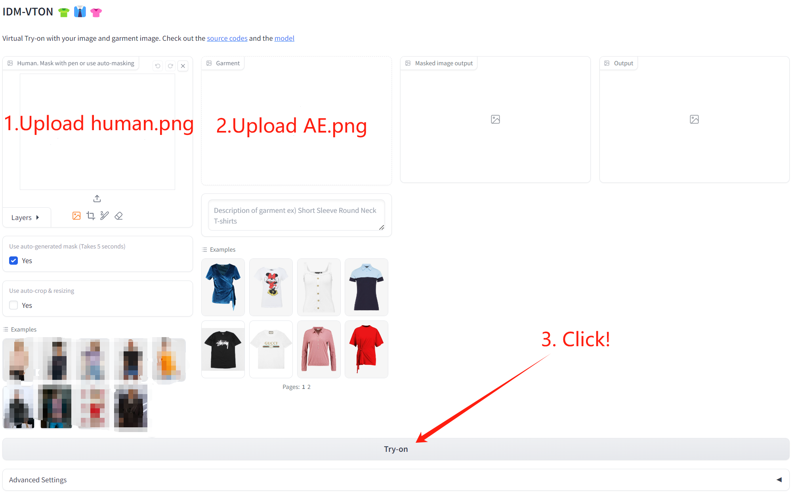
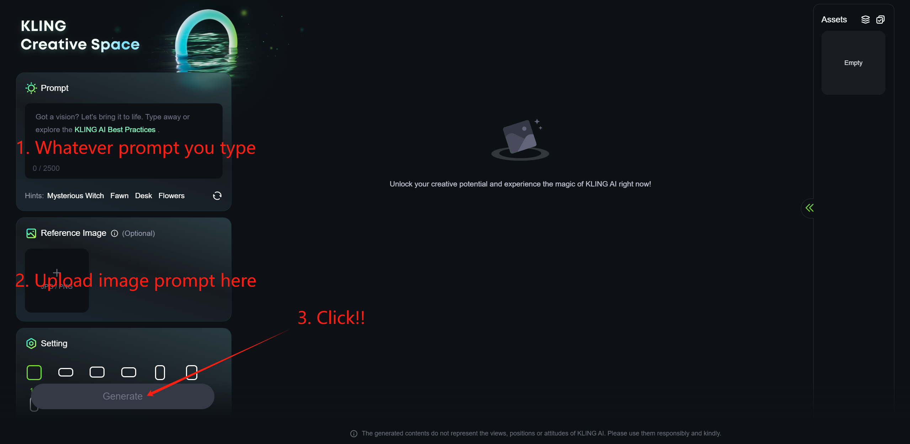
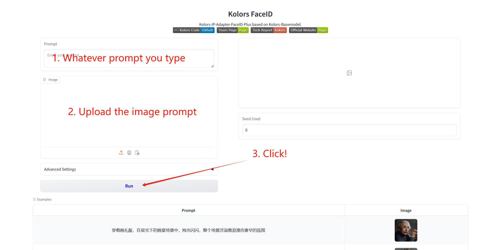

# Experiments for readers

This is the repository of our paper "Mind the Trojan Horse: Image Prompt Adapter Enabling Scalable and Deceptive Jailbreaking".

## Warning
**Though this package does not contain NSFW content for ethical reasons, we alert that running ```./Test1/infer.py``` may output some deformed muscular tattooed men.**

**All real facial images we use are from Celeba-HQ.**

**All online demos were last accessed on November 15, 2024. We do not know whether they will be updated or made unavailable later.**

**The scripts in ```Test5``` will generate AEs that may cause real-world threats if the target image you choose is offensive. Thus, please do not spread these generated AEs on the internet.**

## Overview

The main idea of our paper is hijacking massive benign users to jailbreak T2I-IP-DMs by uploading AEs. As stated in our paper, the feasibility of the hijacking attack lies in the stealthiness of AEs and AEs' performance in triggering adversary-specified (usually NSFW) outputs. Thus, to help readers verify the feasibility of our idea in such a busy and short review period, we design two light-weight experiments:
- Try to manually find AEs, and verify that imperceptible AEs can trigger adversary-specified outputs.
- See if stealthy AEs can survive through the network channel and jailbreak some real-world image generation services (IGS).

## Test 1: Testing Stealthiness and Efficacy

In ```./Test1```, you can find 97 images. There are several AEs hidden in these images. You can try to find out all AEs (One way to find AEs is by checking the flat area of the image. PGD may leave some noisy patterns there) and then compare your answer with the ground truth we provide in ```./Test1/answer.txt```. Since you readers are specialized in adversarial machine learning and are informed of the existence of AEs, your ability in identifying AEs is an overestimated upper bound of the public's.

After playing the Minesweeper game, you can check what AEs trigger by calling
```
python infer.py --gpu YOUR_GPU_INDEX
```
The script will use AEs as image prompts to generate images and save outputs in './Test1/inferResult'. **We alert that these outputs may be unpleasant and offensive. Thus, please do not run ```infer.py``` if you mind.**

## Jailbreaking Real-world IGS

To prove a jailbreak attack is practical, we only need to show that we can jailbreak some real-world IGSs.

### Test 2: Jailbreaking IDM-VTON

In ```./Test2```, you can find an AI-generated human image ```human.png``` and an AE ```AE.png```. **If you do not mind seeing a muscular man, visit IDM-VTON Demo on Hugging Face Spaces and follow the instruction illustrated in the image below:**



As a comparison, you can replace ```AE.png``` with ```clean.png``` to verify that the original benign cloth image will not trigger a muscular man.

### Test 3: Jailbreaking Kolors

In ```./Test3```, you can find AEs ```AE1.png``` and ```AE2.png``` targeting Kolors. You can visit Kolors Text-to-Image Website (search "kling" with your search engine) and follow the instruction illustrated in the image below:



Since Kolors Text-to-Image Website deploys a post-hoc safety checker, you may find that Kolors tells you that the process failed if you input ```AE1.png```. If so, you can try a few more times and may witness images describing a muscular man, indicating successful jailbreaking.

You can also try ```AE2.png```. You can find the synthetic face is dissimilar to the face in ```AE2.png``` yet similar to ```man.jpg```, also indicating that you successfully jailbreak Kolors!

You can also visit Kolors's online demo hosted on Hugging Face Space (Kwai-Kolors/Kolors) and follow the instruction illustrated in the image below:


Since Kolors's online demo hosted on Hugging Face Space does not have any post-hoc safety checker, **you may witness some NSFW outputs**, indicating that you successfully jailbreak Kolors!

As a comparison, you can replace AEs with their clean counterpart (i.e., ```Clean1.png``` and ```Clean2.png```) to verify that the original benign image prompt can not trigger what AEs trigger.

### Test 4: Jailbreaking Kolors FaceID

In ```./Test4```, you can find an AE ```AE3.png``` targeting Kolors FaceID. You can visit The online demo of Kolors FaceID hosted on Hugging Face Space (Kwai-Kolors/Kolors-FaceID) and follow the instruction illustrated in the image below:



You may find that the synthetic face is similar to ```./Test3/man.jpg```, indicating a successful jailbreaking. Try ```Clean3.png``` for comparison.

Kolors FaceID has a more complex preprocessing, including detecting the face (Try ```error.png```. You will encounter an error because the model detects no face.), cropping the face, and resizing the image. We include this experiment to show that preprocessing can hardly be used as a defense if the adversary has the preprocessing pipeline, **which is a common sense.**


### Test 5: Genrating AEs by Yourself

Though our the optimization stage of our attack is simple, we still provide the scripts for generating AEs. 
Follow the shell in ```Test5```, and generate AEs by yourself.
